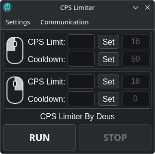

CPS Limiter limits your cps at what number you want.
The purpose of CPS Limiter is to prevent penalties for exceeding the cps limit in various games.
Only works on windows 64-bit and Linux platforms.



## Download CPS Limiter

I was too lazy to upload the app on AUR but you can download it this way.

```bash
mkdir /tmp/cps-limiter-build
curl -L https://raw.githubusercontent.com/DeusTux/CPS-Limiter/linux/PKGBUILD -o /tmp/cps-limiter-build/PKGBUILD
(cd /tmp/cps-limiter-build && makepkg -si)
rm -r /tmp/cps-limiter-build
```

## Delete CPS Limiter

```bash
sudo pacman -Rns cps-limiter
```
